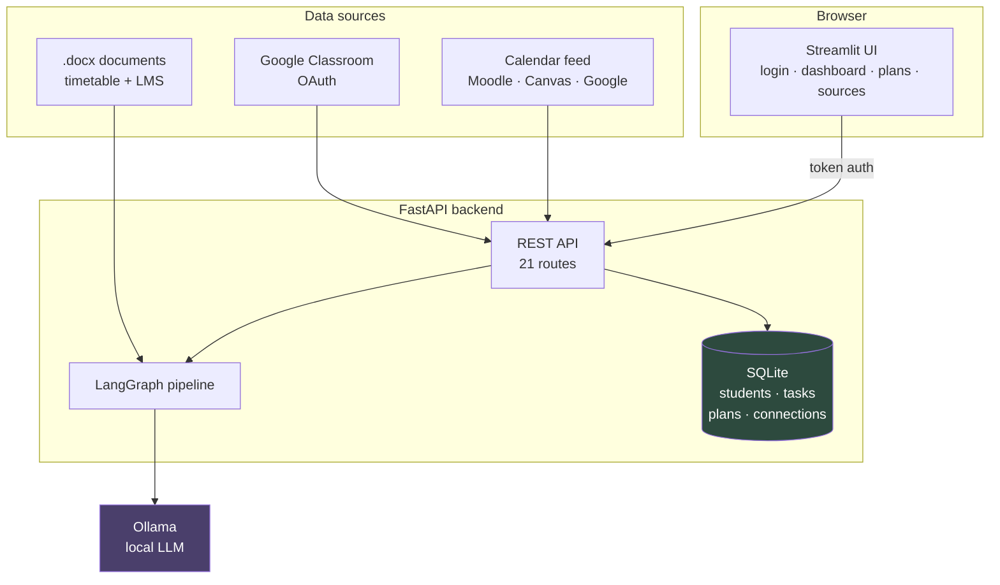
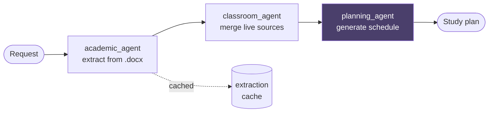
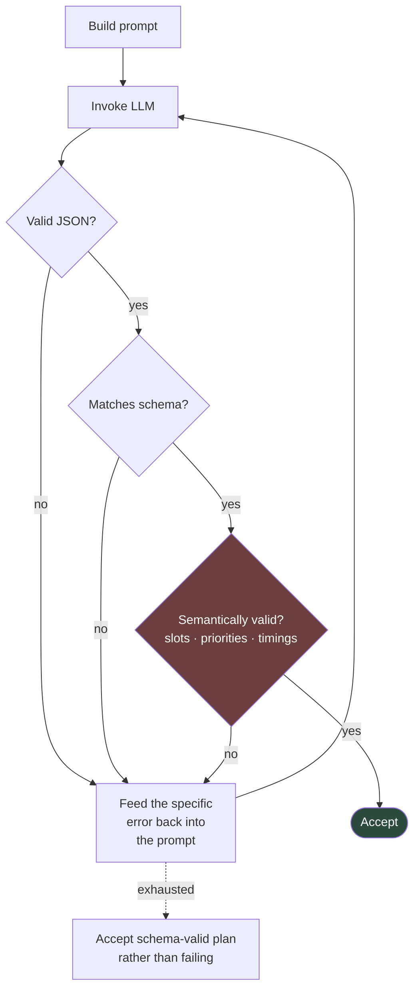
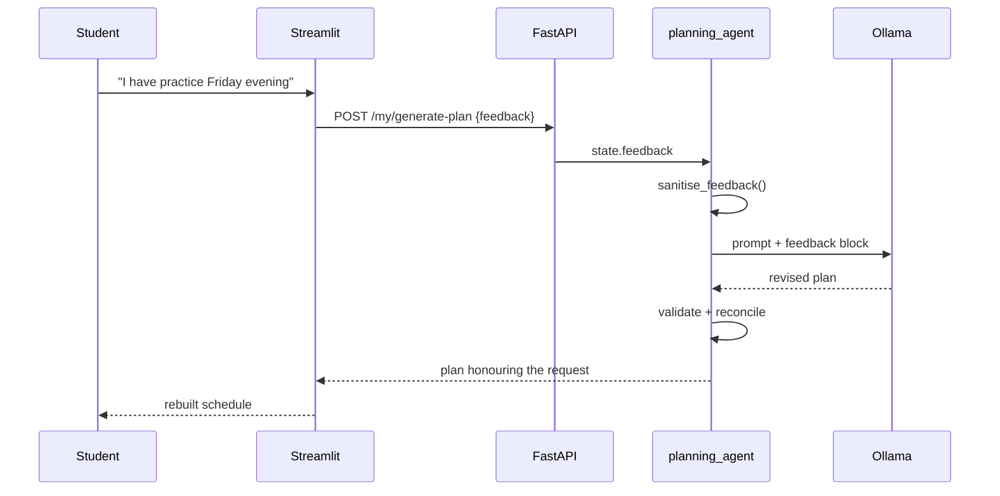
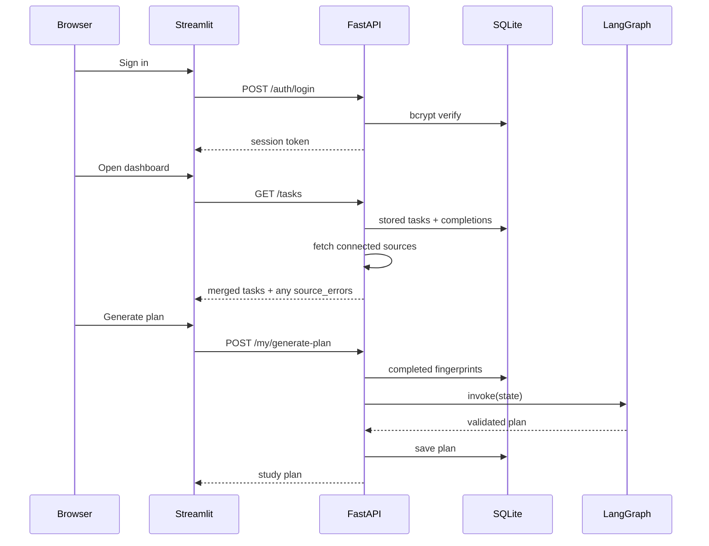

# Architecture

CampusSync AI turns a student's scattered academic obligations into a
realistic study plan. The design principle throughout: **the LLM is used for
language, never for arithmetic or guarantees.**

---

## 1. System overview



Nothing leaves the machine except calls the student explicitly connects. The
model runs locally via Ollama, so no academic data reaches a third-party API.

---

## 2. The planning pipeline



Three LangGraph nodes. Extraction is cached because it is the expensive step —
a warm dashboard renders in under a second, while a cold extraction costs two
LLM calls.

---

## 3. The self-correcting loop

This is the part that makes an unreliable model usable.



The model is never trusted. Every plan is checked against rules Python can
verify, and a failure is fed back as a specific correction rather than a
blind retry.

---

## 4. What the LLM is *not* allowed to decide

| Value | Who decides | Why |
|---|---|---|
| Days remaining | `compute_days_remaining()` | Date arithmetic is exact; models drift |
| Priority band | `expected_priority()` | Pure function of days remaining |
| Free study slots | `extract_study_slots()` | Derived from the real timetable |
| Task completion | The student | Never inferred |
| Deadline | The source document/feed | Copied verbatim, never reworded |

After every generation, `_reconcile()` **overwrites** the model's values for
these fields with Python's. A student can type "mark everything low priority"
as feedback and the priorities will not change — there is a test asserting
exactly that.

---

## 5. Human-in-the-loop feedback



Feedback is untrusted input interpolated into a prompt, so it is capped at 500
characters and the prompt's section delimiter is stripped — a student cannot
forge a new instruction block. This is defence in depth: even if the text did
influence the model, the deterministic reconciliation in §4 still holds.

---

## 6. Data sources

All adapters implement one `Source` protocol returning `(lectures, tasks)`.
The planner never learns where a task came from.

| Source | Auth | Status |
|---|---|---|
| `.docx` documents | none | Built in |
| Upload | app login | Built in |
| Calendar feed (ICS) | student-pasted revocable URL | Built in |
| Google Classroom | OAuth, two read-only scopes | Requires credentials |

**No adapter ever accepts a university password.** Secrets are encrypted at
rest with Fernet, never hashed — they must be replayable to re-sync — and are
destroyed on disconnect.

**A failing source never blocks the others.** Errors surface as `source_errors`
on the response while every healthy source still renders.

---

## 7. Request flow, end to end



Completed tasks are excluded by **fingerprint**, so ticking something off
survives a re-sync from a live feed without duplicating or resurrecting it.

---

## 8. Layout

```
backend/
  agents/      LangGraph nodes
  sources/     pluggable data adapters
  scheduler/   slot extraction, plan validation
  extractors/  .docx parsing
  prompts/     LLM prompt templates
  models/      Pydantic schemas
  db/          SQLModel tables, repository, crypto
  api/         FastAPI routes
frontend/
  views/       login, dashboard, sources
  components/  reusable rendering
  api/         backend client
tests/         292 tests, no LLM or network required
```

`views/` is deliberately not named `pages/` — Streamlit would turn that into
automatic navigation and expose internal modules as clickable pages.
